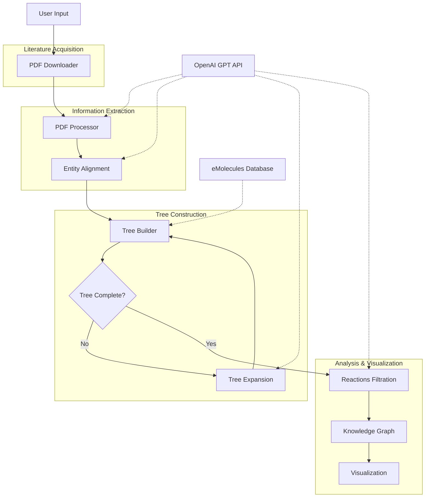

# RetroSynthesisAgent: Comprehensive Documentation

## Table of Contents

1. [Introduction](#introduction)
2. [System Architecture](#system-architecture)
3. [Installation and Setup](#installation-and-setup)
4. [Usage](#usage)
   - [Command Line Interface](#command-line-interface)
   - [API](#api)
   - [Sample API Request](#sample-api-request)
5. [Core Components](#core-components)
   - [PDF Downloader](#pdf-downloader)
   - [PDF Processor](#pdf-processor)
   - [Entity Alignment](#entity-alignment)
   - [Tree Builder](#tree-builder)
   - [Tree Expansion](#tree-expansion)
   - [Reactions Filtration](#reactions-filtration)
   - [Knowledge Graph](#knowledge-graph)
6. [Visualization](#visualization)
7. [Technical Details](#technical-details)
8. [Example Workflow](#example-workflow)
9. [Troubleshooting](#troubleshooting)
10. [Additional Documentation](#additional-documentation)
11. [References](#references)

> **Note**: This document provides a high-level overview of the RetroSynthesisAgent system. For more detailed information, please refer to the additional documentation files.

## Introduction

RetroSynthesisAgent is an advanced AI-powered tool designed to automate retrosynthetic analysis for chemical materials. The system leverages large language models (LLMs) and scientific literature to identify potential synthesis pathways for target compounds.

Retrosynthetic analysis is a problem-solving technique used in organic chemistry where a target molecule is transformed into simpler precursor structures without consideration of starting materials. This transformation is continued until simple or commercially available structures are reached.

This system automates this process by:

1. Downloading relevant scientific literature for a target material
2. Extracting reaction information from the literature
3. Building a retrosynthetic tree
4. Expanding the tree with additional literature when needed
5. Filtering reactions based on feasibility
6. Visualizing the synthesis pathways

## System Architecture



The RetroSynthesisAgent follows a modular architecture with several key components:

1. **Literature Acquisition**: Downloads relevant scientific papers for the target material
2. **Information Extraction**: Processes PDFs to extract reaction information using LLMs
3. **Tree Construction**: Builds a retrosynthetic tree from the extracted reactions
4. **Tree Expansion**: Expands the tree with additional literature for unexpandable intermediates
5. **Reaction Filtration**: Filters reactions based on feasibility and conditions
6. **Visualization**: Provides interactive visualization of the retrosynthetic tree

The system uses OpenAI's GPT models (default: GPT-4o) to extract and process chemical information from scientific literature.

## Installation and Setup

This section provides a brief overview of the installation process. For detailed step-by-step instructions, please refer to the [RetroSynthesisAgent_Installation.md](RetroSynthesisAgent_Installation.md) file.

### Requirements

```bash
conda create -n retrosyn python=3.11
conda activate retrosyn
pip install rdkit requests python-dotenv PyMuPDF scholarly openai networkx graphviz pubchempy Pillow fastapi pydantic uvicorn pyvis loguru redis tqdm
```

Alternatively, you can install from the requirements.txt file:

```bash
pip install -r requirements.txt
```

### Data Setup

1. Download the eMolecules dataset from: https://downloads.emolecules.com/free/

   - For this project, version 2024-07-01 is recommended
   - Place the downloaded file in the project root directory

2. Process the eMolecules dataset:
   ```bash
   python create.py
   ```
   This will create a JSON file with SMILES strings that will be used by the system to identify commercially available compounds.

3. For patent-based retrieval modes, download the molecule_to_patent.jsonl dataset:
   - Download from: https://doi.org/10.5281/zenodo.10572870
   - Place the file in the project root directory
   - Import the data into Redis using the provided script:
   ```bash
   python setup_patent_redis.py
   ```
   This will populate your local Redis database with SMILES-to-patent mappings needed for patent searches.

### Environment Configuration

Create a `.env` file in the project root with the following information:

```
API_KEY=your_openai_api_key
BASE_URL=optional_openai_api_base_url
HEADERS={"user-agent": "your_user_agent"}
COOKIES={"cookie1": "value1", "cookie2": "value2"}
```

The HEADERS and COOKIES are used for web scraping of scientific literature. You can obtain these from your browser's developer tools when visiting scientific paper repositories.

## Usage

### Command Line Interface

To run the RetroSynthesisAgent from the command line:

```bash
python main.py --material [MATERIAL_NAME] --num_results [NUMBER_OF_PAPERS] --alignment [True/False] --expansion [True/False] --filtration [True/False] --retrieval_mode [MODE]
```

The `retrieval_mode` parameter controls how documents are retrieved:
- `patent-patent`: Uses patents for both initial retrieval and expansion
- `paper-paper`: Uses academic papers for both initial retrieval and expansion
- `both-both`: Uses both patents and papers for both initial retrieval and expansion (retrieves approximately 8 documents from each source by default)

Examples:

```bash
# Using academic papers for both initial retrieval and expansion
python main.py --material polyimide --num_results 15 --alignment True --expansion True --filtration True --retrieval_mode paper-paper

# Using both patents and papers for initial retrieval and expansion
python main.py --material aspirin --num_results 16 --alignment True --expansion True --filtration True --retrieval_mode both-both
```

Alternatively, you can use the provided shell scripts:

```bash
# Run with default settings
sh runRetroSynAgent.sh

# Try all retrieval modes
sh run_retrieval_modes.sh [MATERIAL_NAME] [NUMBER_OF_PAPERS]
```

### API

The system also provides a FastAPI-based REST API for integration with other applications.

To start the API server:

```bash
uvicorn api:app --reload
```

This will start the server at http://localhost:8000

### Sample API Request

```bash
curl --location 'http://localhost:8000/retro-synthesis/' \
--header 'Content-Type: application/json' \
--data '{
           "material": "polyimide",
           "num_results": 15,
           "alignment": true,
           "expansion": true,
           "filtration": true,
           "retrieval_mode": "paper-paper"
         }'
```

For more detailed API usage examples and integration patterns, please refer to the [RetroSynthesisAgent_API_Examples.md](RetroSynthesisAgent_API_Examples.md) file.

## Core Components

### PDF Downloader

The system includes two document retrieval components:

#### Academic Paper Downloader

The PDFDownloader component is responsible for searching and downloading scientific literature related to the target material. It uses the Google Scholar API through the scholarly library to find relevant papers and then attempts to download them using Sci-Hub.

Key features:

- Searches for papers related to the target material and synthesis
- Downloads PDFs using multiple threads for efficiency
- Handles cases where papers are not available for download
- Maintains a list of already downloaded papers to avoid duplicates

#### Patent Downloader

The PatentPDFDownloader component retrieves patents related to a specific chemical structure (SMILES string). It uses a local Redis database populated with SMILES-to-patent mappings.

Key features:

- Searches for patents based on SMILES strings
- Automatically converts chemical names to SMILES when possible
- Downloads patent PDFs from Google Patents
- Handles various patent formats and jurisdictions
- Implements retry mechanisms and error handling

### PDF Processor

The PDFProcessor extracts text and images from the downloaded PDFs and uses LLMs to identify chemical reactions. It processes the PDFs in batches and saves the extracted information for later use.

Key features:

- Extracts text and images from PDFs
- Uses GPT models to identify chemical reactions
- Processes PDFs in batches for efficiency
- Caches results to avoid reprocessing

### Entity Alignment

The EntityAlignment component ensures consistency in substance naming across different papers. It uses LLMs to identify and standardize chemical names, which is crucial for building an accurate retrosynthetic tree.

Key features:

- Aligns the root node (target material) across all papers
- Creates a mapping of synonyms for chemical substances
- Standardizes chemical names across the entire dataset

### Tree Builder

The TreeBuilder constructs a retrosynthetic tree from the extracted reactions. It identifies pathways from the target material to commercially available starting materials.

Key features:

- Builds a tree structure with the target material as the root
- Identifies commercially available starting materials
- Calculates all possible synthesis pathways
- Handles cycles in the reaction network

### Tree Expansion

The TreeExpansion component expands the retrosynthetic tree by finding additional literature for intermediates that cannot be synthesized from commercially available starting materials.

Key features:

- Identifies unexpandable intermediates in the tree
- Searches for additional literature specifically for those intermediates
- Supports multiple retrieval modes (academic papers, patents, or both)
- Integrates new reactions into the existing tree
- Iteratively expands the tree until all pathways lead to commercially available starting materials
- Implements fallback mechanisms when certain retrieval methods fail

### Reactions Filtration

The ReactionsFiltration component filters reactions based on feasibility, conditions, and other criteria. It uses LLMs to evaluate reactions and pathways.

Key features:

- Filters reactions based on conditions (temperature, pressure, etc.)
- Evaluates the feasibility of reaction pathways
- Recommends optimal synthesis pathways based on various criteria

### Knowledge Graph

The KnowledgeGraph component creates a network representation of the chemical substances and their relationships. It provides an alternative visualization of the retrosynthetic analysis.

Key features:

- Creates a directed graph of chemical substances
- Visualizes relationships between substances
- Exports the graph to various formats for further analysis

## Visualization

The system provides interactive visualization of the retrosynthetic tree using D3.js. The visualization allows users to explore the synthesis pathways and understand the relationships between chemical substances.

To view the visualization:

```bash
uvicorn vistree:app --reload
```

Then open a web browser and navigate to http://localhost:8000

The visualization includes:

- Interactive radial tree layout
- Highlighting of specific pathways
- Comparison of different trees (with/without expansion, filtered, etc.)
- Table of chemical substances with their indices

## Technical Details

### LLM Integration

The system uses OpenAI's GPT models (default: GPT-4o) for various tasks:

- Extracting reactions from scientific literature
- Aligning chemical entity names
- Evaluating reaction feasibility
- Recommending optimal synthesis pathways

The GPTAPI class provides a unified interface for interacting with the OpenAI API, supporting both text-only and vision-enabled queries.

### Tree Data Structure

The retrosynthetic tree is implemented as a hierarchical structure:

- Each node represents a chemical substance
- Children of a node are the reactants needed to synthesize it
- Leaf nodes are commercially available starting materials
- The root node is the target material

The tree supports various operations:

- Finding all synthesis pathways
- Counting nodes and pathways
- Serialization for storage and visualization

### Caching and Persistence

The system implements caching at various levels to improve performance:

- Downloaded PDFs are stored locally
- Extracted reactions are cached in JSON files
- Trees are serialized using pickle for later use
- Chemical substance queries are cached to avoid redundant API calls

## Example Workflow

Here's a step-by-step example of how the system processes a request for "polyimide":

1. **Literature Acquisition**:

   - Searches for papers related to "polyimide AND synthesis"
   - Downloads the top 15 papers

2. **Information Extraction**:

   - Processes the downloaded PDFs
   - Extracts reactions involving polyimide

3. **Entity Alignment**:

   - Standardizes names for polyimide and related compounds
   - Creates a mapping of synonyms

4. **Tree Construction**:

   - Builds a retrosynthetic tree with polyimide as the root
   - Identifies commercially available starting materials

5. **Tree Expansion**:

   - Identifies intermediates that cannot be synthesized from commercially available starting materials
   - Searches for additional literature for those intermediates
   - Expands the tree with new reactions

6. **Reaction Filtration**:

   - Filters reactions based on feasibility and conditions
   - Recommends optimal synthesis pathways

7. **Visualization**:
   - Generates an interactive visualization of the retrosynthetic tree
   - Highlights recommended pathways

For more detailed workflow examples with different materials, please refer to the [RetroSynthesisAgent_Workflow_Examples.md](RetroSynthesisAgent_Workflow_Examples.md) file.

## Troubleshooting

### Common Issues

1. **PDF Download Failures**:

   - Check your internet connection
   - Verify that the HEADERS and COOKIES in your .env file are up to date
   - Some papers may not be available for download

2. **LLM API Errors**:

   - Verify that your API_KEY is correct
   - Check your API usage limits
   - Consider using a different model if you're experiencing rate limits

3. **Tree Construction Failures**:

   - Ensure that the eMolecules dataset is properly processed
   - Check if the target material is correctly identified in the literature
   - Try increasing the number of papers to download

4. **Visualization Issues**:
   - Make sure all required JavaScript libraries are available
   - Check browser console for errors
   - Try a different browser if you're experiencing rendering issues

## Additional Documentation

For more detailed information about specific aspects of the RetroSynthesisAgent system, please refer to the following documentation files:

1. [RetroSynthesisAgent_Installation.md](RetroSynthesisAgent_Installation.md) - Detailed installation and setup instructions
2. [RetroSynthesisAgent_API_Examples.md](RetroSynthesisAgent_API_Examples.md) - API usage examples and integration patterns
3. [RetroSynthesisAgent_Workflow_Examples.md](RetroSynthesisAgent_Workflow_Examples.md) - Detailed workflow examples with different materials
4. [RetroSynthesisAgent_Architecture.md](RetroSynthesisAgent_Architecture.md) - Detailed system architecture diagrams and component relationships

## References

1. RetroSynthesis: A practice of organic synthesis

   - E.J. Corey, X.-M. Cheng, The Logic of Chemical Synthesis, Wiley, New York, 1989

2. Large Language Models for Chemical Information Extraction

   - Various papers on using LLMs for scientific information extraction

3. eMolecules Database

   - https://downloads.emolecules.com/free/

4. OpenAI API Documentation

   - https://platform.openai.com/docs/api-reference

5. D3.js Documentation
   - https://d3js.org/
