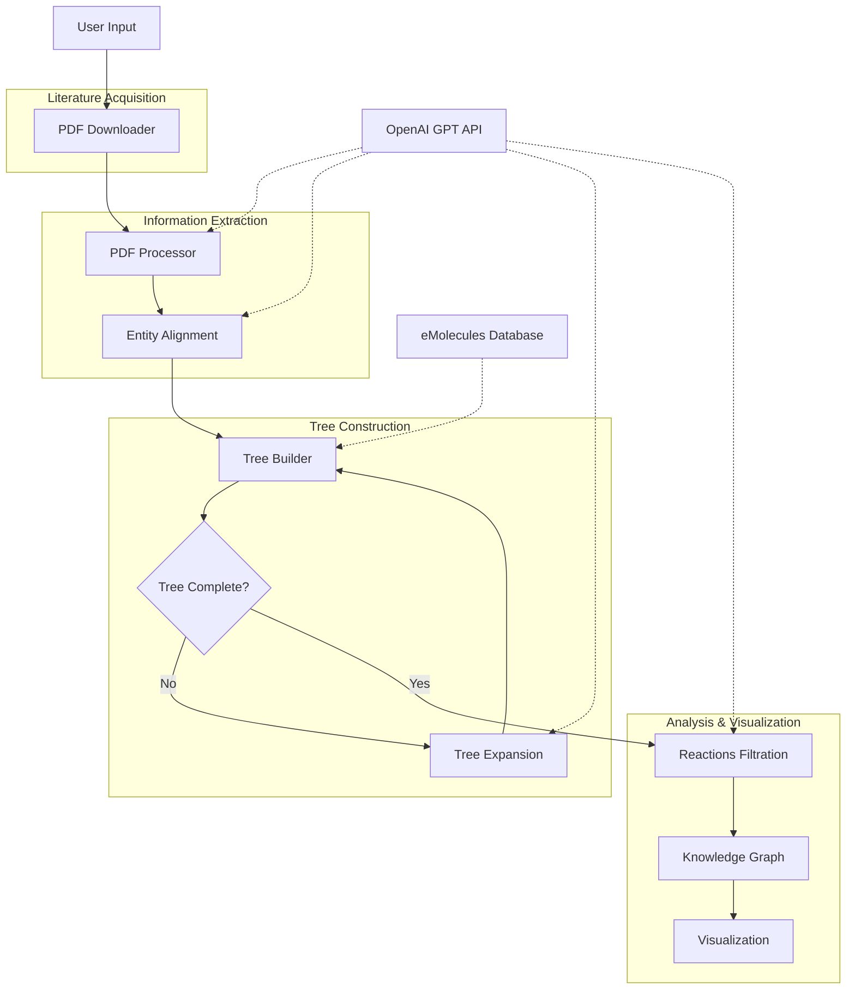
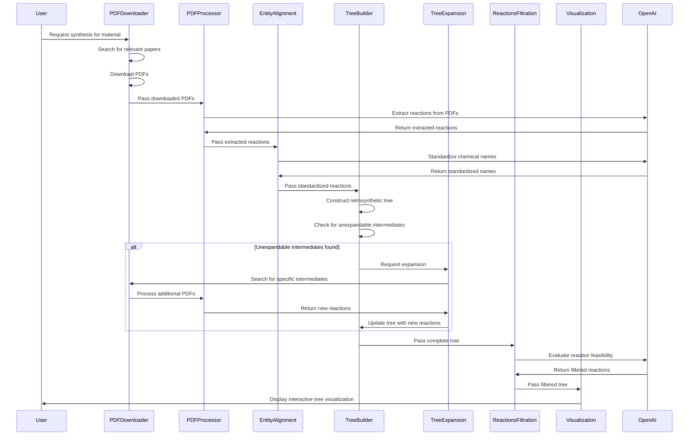
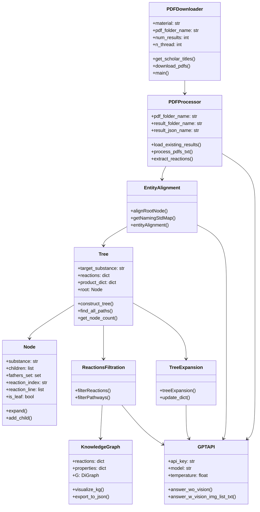

# RetroSynthesisAgent: System Architecture

```mermaid
graph TD
    A[User Input] --> B[PDF Downloader]
    B --> C[PDF Processor]
    C --> D[Entity Alignment]
    D --> E[Tree Builder]
    E --> F{Tree Complete?}
    F -->|No| G[Tree Expansion]
    G --> E
    F -->|Yes| H[Reactions Filtration]
    H --> I[Knowledge Graph]
    I --> J[Visualization]
    
    subgraph "Literature Acquisition"
    B
    end
    
    subgraph "Information Extraction"
    C
    D
    end
    
    subgraph "Tree Construction"
    E
    F
    G
    end
    
    subgraph "Analysis & Visualization"
    H
    I
    J
    end
    
    K[OpenAI GPT API] -.-> C
    K -.-> D
    K -.-> G
    K -.-> H
    
    L[eMolecules Database] -.-> E
```

# RetroSynthesisAgent: Workflow Diagram

```mermaid
sequenceDiagram
    participant User
    participant PDFDownloader
    participant PDFProcessor
    participant EntityAlignment
    participant TreeBuilder
    participant TreeExpansion
    participant ReactionsFiltration
    participant Visualization
    participant OpenAI
    
    User->>PDFDownloader: Request synthesis for material
    PDFDownloader->>PDFDownloader: Search for relevant papers
    PDFDownloader->>PDFDownloader: Download PDFs
    PDFDownloader->>PDFProcessor: Pass downloaded PDFs
    
    PDFProcessor->>OpenAI: Extract reactions from PDFs
    OpenAI->>PDFProcessor: Return extracted reactions
    PDFProcessor->>EntityAlignment: Pass extracted reactions
    
    EntityAlignment->>OpenAI: Standardize chemical names
    OpenAI->>EntityAlignment: Return standardized names
    EntityAlignment->>TreeBuilder: Pass standardized reactions
    
    TreeBuilder->>TreeBuilder: Construct retrosynthetic tree
    TreeBuilder->>TreeBuilder: Check for unexpandable intermediates
    
    alt Unexpandable intermediates found
        TreeBuilder->>TreeExpansion: Request expansion
        TreeExpansion->>PDFDownloader: Search for specific intermediates
        PDFDownloader->>PDFProcessor: Process additional PDFs
        PDFProcessor->>TreeExpansion: Return new reactions
        TreeExpansion->>TreeBuilder: Update tree with new reactions
    end
    
    TreeBuilder->>ReactionsFiltration: Pass complete tree
    ReactionsFiltration->>OpenAI: Evaluate reaction feasibility
    OpenAI->>ReactionsFiltration: Return filtered reactions
    ReactionsFiltration->>Visualization: Pass filtered tree
    
    Visualization->>User: Display interactive tree visualization
```

# RetroSynthesisAgent: Component Diagram

```mermaid
classDiagram
    class PDFDownloader {
        +material: str
        +pdf_folder_name: str
        +num_results: int
        +n_thread: int
        +get_scholar_titles()
        +download_pdfs()
        +main()
    }
    
    class PDFProcessor {
        +pdf_folder_name: str
        +result_folder_name: str
        +result_json_name: str
        +load_existing_results()
        +process_pdfs_txt()
        +extract_reactions()
    }
    
    class EntityAlignment {
        +alignRootNode()
        +getNamingStdMap()
        +entityAlignment()
    }
    
    class Tree {
        +target_substance: str
        +reactions: dict
        +product_dict: dict
        +root: Node
        +construct_tree()
        +find_all_paths()
        +get_node_count()
    }
    
    class Node {
        +substance: str
        +children: list
        +fathers_set: set
        +reaction_index: str
        +reaction_line: list
        +is_leaf: bool
        +expand()
        +add_child()
    }
    
    class TreeExpansion {
        +treeExpansion()
        +update_dict()
    }
    
    class ReactionsFiltration {
        +filterReactions()
        +filterPathways()
    }
    
    class KnowledgeGraph {
        +reactions: dict
        +properties: dict
        +G: DiGraph
        +visualize_kg()
        +export_to_json()
    }
    
    class GPTAPI {
        +api_key: str
        +model: str
        +temperature: float
        +answer_wo_vision()
        +answer_w_vision_img_list_txt()
    }
    
    PDFDownloader --> PDFProcessor
    PDFProcessor --> EntityAlignment
    EntityAlignment --> Tree
    Tree --> Node
    Tree --> TreeExpansion
    Tree --> ReactionsFiltration
    ReactionsFiltration --> KnowledgeGraph
    
    PDFProcessor --> GPTAPI
    EntityAlignment --> GPTAPI
    TreeExpansion --> GPTAPI
    ReactionsFiltration --> GPTAPI
```

# RetroSynthesisAgent: Data Flow Diagram

```mermaid
graph LR
    A[Target Material] --> B[Literature Search]
    B --> C[PDF Downloads]
    C --> D[Text & Image Extraction]
    D --> E[Reaction Extraction]
    E --> F[Entity Standardization]
    F --> G[Reaction Network]
    G --> H[Retrosynthetic Tree]
    H --> I[Tree Expansion]
    I --> J[Reaction Filtration]
    J --> K[Pathway Recommendation]
    K --> L[Interactive Visualization]
    
    style A fill:#f9d5e5,stroke:#333,stroke-width:2px
    style L fill:#d5f9e5,stroke:#333,stroke-width:2px
```
